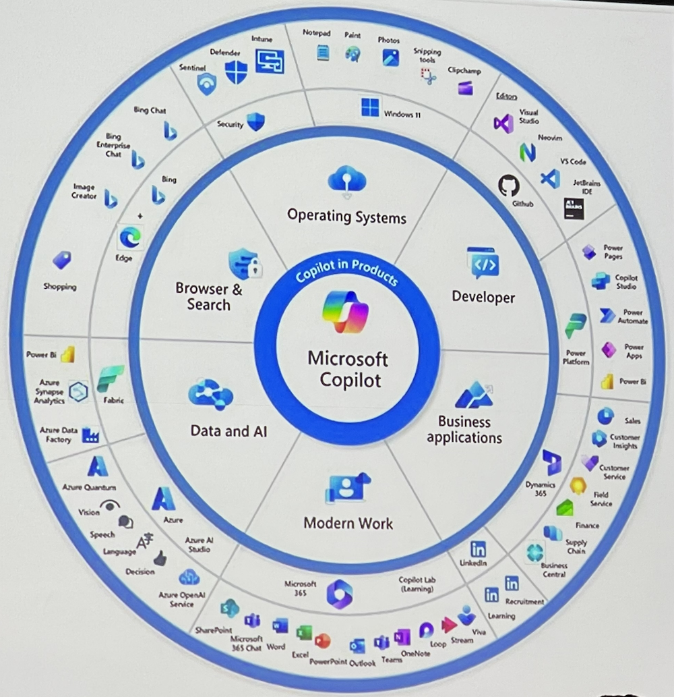
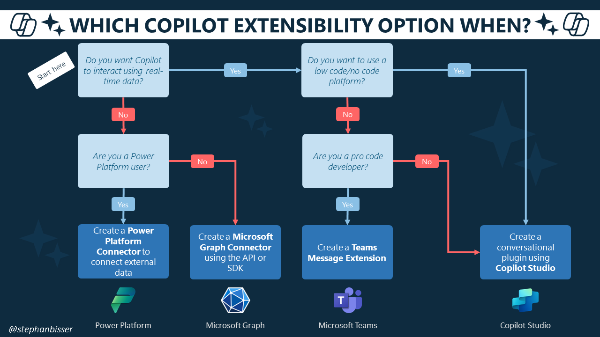
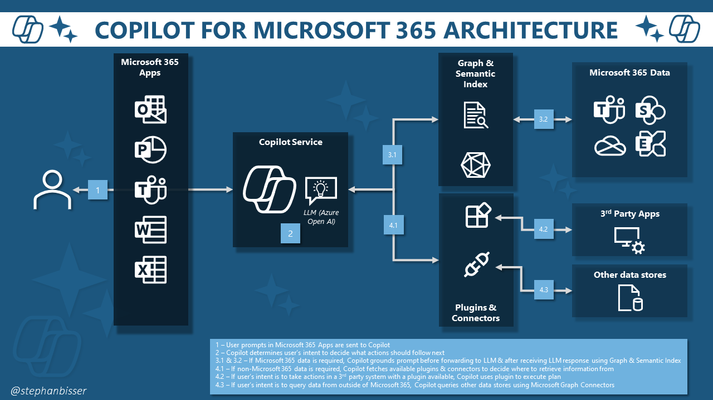
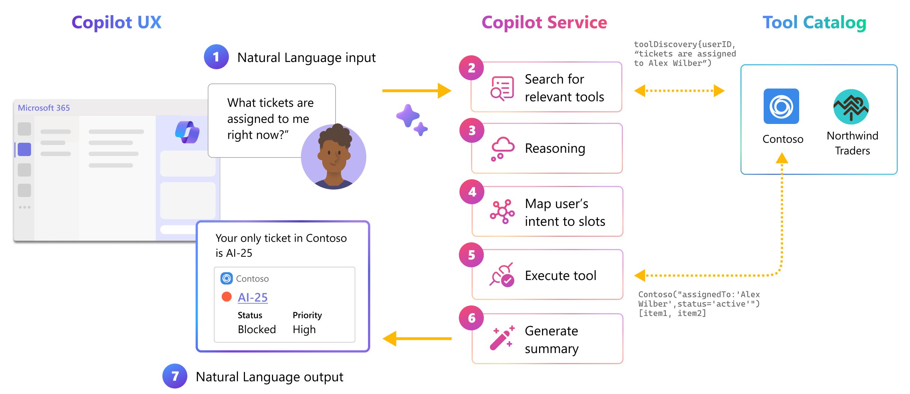

# Extend your Copilot - In and outs of Microsoft 365 Copilot Extensibility

There are 117 different Copilots in the Microsoft ecosystem:

There are some threats coming along with using AI powered tools – categorized into these items:

1. Misalignment
2. Jailbreaks
3. Prompt injections

There are two options to extend Copilot:

1. Adding knowledge 
   Use Graph Connectors to ingest data and content from a 3rd systrem. Think of a search source that provides
2. Plugins 
   Ingest live data. They are available in the app store or can be created by yourself

Decide which Copilot extensibility option should be used by considering this decision table (by [Stephan Bisser](https://bisser.io/copilot-for-microsoft-365-series-2-extensibility-options/)):

## Extensibility

### Copilot studio (Live demo)

Keep in mind that when building plugins, you always have to set up the «instructions» on the "topic".
The way Copilot plugins work is as follows (by [Stephan Bisser](https://bisser.io/copilot-for-microsoft-365-series-3-technical-architecture/)):

1. User’s prompts in Microsoft 365 Apps are sent to Copilot
1. Copilot determines user’s intent to decide what actions should follow next
1. If Microsoft 365 data is required, Copilot grounds prompt before forwarding to LLM & after receiving LLM response using Graph & Semantic Index
1. If non-Microsoft 365 data is required, Copilot fetches available plugins & connectors to decide where to retrieve information from. If user’s intent is to take actions in a 3rd party system with a plugin available, Copilot uses plugin to execute plan

By writing Graph Connectors, you can implement your onw Copilot data ingestion concept. Keep in mind, that any implementation should always follow some guidelines – and ALWAYS implement `acls` to take care who can access your data.

### Code options

Your implementation is nothing more than a **Teams Messaging Extension** that returns a result as an **Adaptive Card**.
By saying this, an appropriate **`description` definition in the manifest** (👉 the general description, the `commands` description and the `parameter` description) is crucial: the values tell the Copilot engine when to engage this custom extension – and which data comes from the parameters.

The following chart illustrates how the Copilot for Microsoft 365 orchestrator selects the right plugin, with the right skill, at the right time, even when there are thousands of options to choose from:

## Challenges when building plugins

* Anti-Compete: you never know which other plugins are in use, never use the name of any other plugin in both short and long descripts
* Responsible AI: aviod using inappropriate or offensive keywords

👉 Look for GitHub samples before you start working / coding – and watch the security session from Johann Rehberger