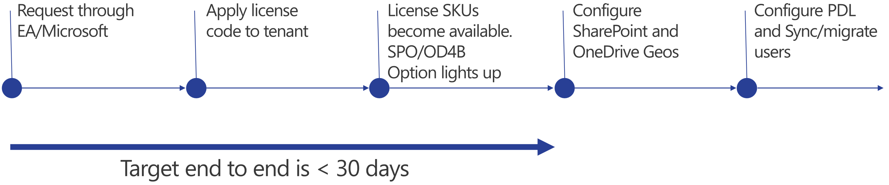

# Where on earth is my data - The Multi-Geo Deep Dive

M365 is sold by GEO, with services spread across regional Data Centres. By buying the service, every service is bound to a given data center in a geographic region (you can't specify to which geographic sub-region the service will be bound; you only can choos the region itself).

Multi Geo enables

- work as a single organisation within a single tenant
- a unifiied search experience
- a single source of truth for identity & security
- granular data controls for residency in Multi Geo aware services

Multi-Geo does not automatically make you GDPR Compliant!
As a requirement, a minimum of 250 Office 365 Services Subscription is needed, whereas a minimum of 5% of all tenant users need to be licensed for Multi-Geo.

To register your company for Multi Geo usage, the following process is complimentary:

PDL = Preferred Data Locaion

A registered Multi-Geo tenant setup can be managed through additional sections in the SharePoint Admin Center:

Following services are Multi-Geo aware:

- Teams: Group, Channel and Private chats use Azure storage based on the PDL of the Group or user. Channel uploads use TEams SPO location based on creators PDL, Private chat uses uploaders OneDrive for files 
  👉 the user must be licensed with a Multi-Geo license to be migrated
- Exchange is 100% Multi-Geo aware
- Viva: file uploads in O365 Connected Groups only; all other group files and chat uses the Parent Tenant storage
- SharePoint and OneDrive are 100% Multi-Geo aware, modern site creation is based on the PDL of the creator, OD4B is based on the PDL of the user at provisioning.

### Services

- For internal users, a **search request** aggegrates all search results from all the different search indexes in the according GEO.
  Guest users only see the search results based on the search index of the according GEO.
- **Search Connectors** are only aware of the parent GEO Location, same to **eDiscovery**; eDiscovery requests are limited to the Parent GEO. eDiscovery exports are sent to a close Azure region and are not truly Multi-Geo.
- **Managed Metadata** belongs to the according GEO, but they are replicated from the parent GEO (if replication is enabled). Therefore, changes should only be made in the parent groups, replication is one-way!
  Term groups created in the child tenants are local to that GEO location only.
- **Content Types** created in the Parent tenant are replicated to the child tenants in the according GEO.
**- M365 CoPilot** now supports EU Data Boundary but NOT for Multi-Geo customers; prompt history and responses are stored within a users's Mailbox in their PDL

Everything else? Assume Parent: 😃 
Viva Learning, Syntex content center, Teams Webinars, Custom SPO Forms (PowerApps), SPO Triggered Flows, Teams Approvals (remain in the Default Env of the PPL)

## Aadding a new GEO
Impact on services:
- ExO mailbox migrations are triggered automatically when the Users's PDL does not match the current mailbox database location
- SPO migrations are triggered manually (or can be scheduled) using PoSh
- OD4B migrations are triggered manually by PoSh after changing the Users PDL
- Teams chat migration is driven by the Users PDL (the user mut be assigned a Multi-Geo license – changing the PDL or Removing Multi-GEO license will trigger a migration)

Consider additional admin overhead and an increase of costs.
Therefore, **business should be the driver** – IT only should be the enabler (not vice-versa). It never should b e an IT decision.