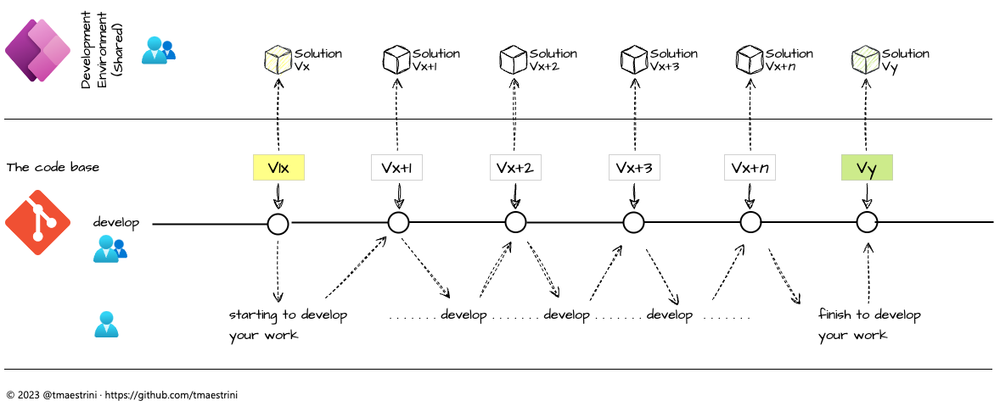
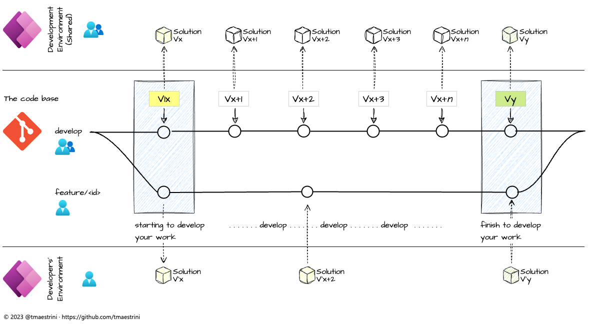

# Developing Power Apps in a developers team

## Prerequisites
First of all, make sure that you’re familiar with the following two master pieces:

1. the foundations of GIT Flow: [Introduction to Git Flow](../git/Introduction%20to%20Git%20Flow.md)
2. a CI/CD scenario that makes use of build and release pipelines (Azure Devops or Git GitHub Actions)

## Development team setup
It doesn’t matter if you are developing one or more Power Apps with one or more devs – the «right choice» is to make on the decision on how you want to work together.
There are two scenarios that are relevant to you and the dev team:

<table>
  <tr>
    <td valign="top">Scenario</td>
    <td valign="top">Code Repository Setup</td>
    <td valign="top">Power Platform Environment Setup</td>
  </tr>
  <tr>
    <td valign="top">Scenario A: «Standard»</td>
    <td valign="top">All developers share two branches:
      <ul><li><code>develop</code> contains one shared codebase that is synchronized with the development environment
          <li><code>main</code> contains the production-ready code that can be deployed in the production environment
      </ul></td>
    <td valign="top">Two shared environments:
      <ul><li>development environment
      </ul>production environment
    </td>
  </tr>
  <tr>
    <td valign="top">Scenario B: «Grow together»</td>
    <td valign="top">All developers share two branches:
      <ul><li><code>develop</code> contains one shared and actual code base that is synchronized with the development environment
          <li><code>main</code> contains the production-ready code that can be deployed in the production environment
      </ul>
      Upon starting to implement an new feature, every developer creates his / her own feature branch:
      <ul><li><code>feature/{id of epic or task}</code> the git flow feature branch, holding the code base of the content that is currently in development by the dev
      </ul>
    </td>
    <td valign="top">Two shared environments:
      <ul><li>development environment
          <li>production environment
      </ul>
      <i>n</i> individual environments (one per dev):
      <ul><li>developers' environment
      </ul>
    </td>
  </tr>
</table>

As mentioned earlier, it does not matter how many devs are working together – it depends on how you want to share and organize your development setup.

👉 One crucial thing: always choose the setup that supports you the most and makes you best productive!

## Scenario A: «Standard»

## Scenario B: «Grow together»
When choosing scenario B, every dev must checkout the latest develop branch and initialize a new feature branch – always before he starts to work on the epic or task that has to be implemented. Don’t forget to push the branch to the central repository (backup and collaboration purpose).

Given that, the develop branch always hold the actual code base that stays in sync with the development environment on the Power Platform, while the evolution of the current feature and its code base is completely independent from the develop branch. No matter if the progress of the development of your Power App goes with the speed of light and the code base changes daily: your code on the feature branch is always safe! As soon you’re in the stage of developing the new feature, create and remain onto the feature branch – and merge back into the develop branch when you're finished. 

Each new feature should be on its own branch (that can be pushed to the central repository for backup / collaboration purposes). 
When a feature is finished, it is merged back into the develop branch.

Let’s put that into a drawing:

### Why every dev needs his own development environment in the Power Platform
Guess why… You’re right: as long as you develop in your own environment – no one else’s changes will affect your work. This means that your work is always safe from «accidental move of destruction» (as long that you’re backing up the changes on your feature branch in the central repository) or a change that affects the same module.

Even if a «massive change» was published on the develop branch while your feature development is in progress: check the develop branch out to your local repo, and update your feature branch (at this time or at the end – as you wish): your work will always be safely backed up by the commits on your feature branch. That’s it! 😃